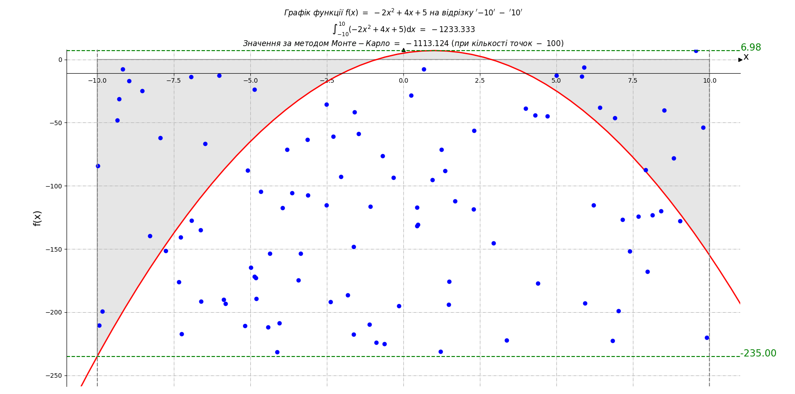
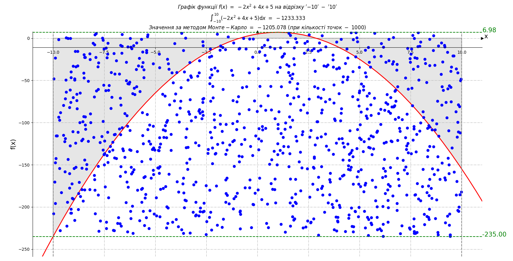

# HomeWork Module 10 Neoversity

<h3>HomeWork_10_1.py: <b>Оптимізація виробництва</b></h3>

Компанія виробляє два види напоїв: "Лимонад" і "Фруктовий сік". Для виробництва цих напоїв використовуються різні інгредієнти та обмежена кількість обладнання. Задача полягає у максимізації виробництва, враховуючи обмежені ресурси.

<b>Умови завдання:</b>

<ol>
    <li>"Лимонад" виготовляється з "Води", "Цукру" та "Лимонного соку".</li>
    <li>"Фруктовий сік" виготовляється з "Фруктового пюре" та "Води".</li>
    <li>Обмеження ресурсів: 100 од. "Води", 50 од. "Цукру", 30 од. "Лимонного соку" та 40 од. "Фруктового пюре".</li>
    <li>Виробництво одиниці "Лимонаду" вимагає 2 од. "Води", 1 од. "Цукру" та 1 од. "Лимонного соку".</li>
    <li>Виробництво одиниці "Фруктового соку" вимагає 2 од. "Фруктового пюре" та 1 од. "Води".</li>
</ol>

Використовуючи PuLP, створіть модель, яка визначає, скільки "Лимонаду" та "Фруктового соку" потрібно виробити для максимізації загальної кількості продуктів, дотримуючись обмежень на ресурси. Напишіть програму, код якої максимізує загальну кількість вироблених продуктів "Лимонад" та "Фруктовий сік", враховуючи обмеження на кількість ресурсів.

<h3>HomeWork_10_2.py: <b>Обчислення визначеного інтеграла</b></h3>

Ваше друге завдання полягає в обчисленні значення інтеграла функції методом Монте-Карло.

<ol>
    <li>Обчисліть значення інтеграла функції за допомогою методу Монте-Карло, інакше кажучи, знайдіть площу під цим графіком (сіра зона).</li>
    <li>Перевірте правильність розрахунків, щоб підтвердити точність методу Монте-Карло, шляхом порівняння отриманого результату та аналітичних розрахунків або результату виконання функції <b>quad</b>. Зробіть висновки.</li>
</ol>

## Результати

Для обчислення визначеного інтеграла методом Монте-Карло було обрано функцію квадратного рівняння виду $-2x^2+4x+5$.

Алгоритм дозволяє для обраної функції на певному проміжку провести моделювання та отримати результат.

Для визнаяення якості методу Монте-Карло було розраховано точне значення визначеного інтегралу за допомогою методу <b>quad</b> бібліотеки SciPy.

Так бачимо, що при невеликих значеннях випадкових точок в експерименті ми маємо суттєву похибку в розрахунках. Нижче наведено приклади роботи алгоритму на для зазначеної функції на відрізку $-10 - +10$ при кількості точок 100 та 1000.

Навіть при кількості точок 10 000 ми все ще маємо середню похибку в районі 2%. І лише при кількості точок більше 100 000 похибка буде вже менше 1%.